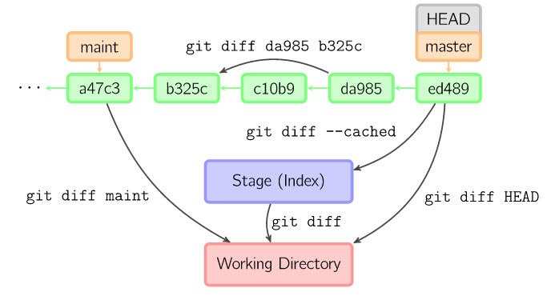

 

    git config --global alias.co checkout 给命令设置别名
    git init                    创建一个空仓库
    git init --bare             创建一个不带工作区的仓库（适合用于中心仓库初始化）
    git status                  查看版本库当前状态
    git log                     查看提交历史
                                    git log --pretty=oneline 单行显示
                                    git log --graph 显示分支合并图
    git reflog                  查看所有操作记录，可以用来找回已删除的commit记录
***
    git add <file>              把文件添加到暂存区  
                                    git add a.txt  
                                    git add . 把所有文件添加到暂存区
    git commit -m “msg”         提交暂存区的内容到本地仓库
    git commit -a -m “msg”      先git add再git commit
    git push <remote repository> <local branch>:<remote branch> 格式
    git push origin hotfix      将本地分支（hotfix）推送到远程仓库（远程没有hotfix分支相当于
                                新建远程分支）
    git push origin :hotfix     删除远程hotfix分支（把空白分支推送到hotfix分支）
    git push                    把修改变化推入别名为"origin"的远程本库

    git pull                    从远程版本库中取来修改变化，并合并到当前的本地分支
    git merge <name>            合并分支到当前分支
***
    git branch                  列出本地所有分支
    git branch -r               列出远程所有分支
    git branch -a               列出所有分支
    git branch <name>           基于当前分支创建新分支
    git branch bname origin/bname 基于指定分支创建新分支
    git branch -d bname         删除bname分支
***
    git checkout bname          切换到bname分支
	git checkout -b bname       基于当前分支创建并切换到bname分支
	git checkout -b hotfix origin/hotfix    基于远程hotfix分支新建并切换到本地hotfix分支
***
    git checkout [<tree-ish>] [--] <pathspec>...
    git checkout -- a.txt       用暂存区里的a.txt或者最近一次commit的a.txt覆盖工作空间的a.txt（丢弃在工作区对a.txt的更改）
    git checkout -- .           丢弃工作区的所有更改（使用暂存区的或最近一次提交的内容覆盖工作区有改动的文件） 
    git checkout commitid -- a.txt 使用commitid中的a.txt版本覆盖工作区和暂存区中a.txt
    git checkout commitid -- .  使用commitid版本恢复工作区和暂存区中的所有文件   

    git reset [<mode>] [<commit>] 如果没有模式，默认为“--mixed”，该模式只重置暂存区，不影响工作区
    git reset HEAD <file>...    把文件从暂存区移除，不影响工作区对文件的修改
    git reset HEAD              把暂存区的文件全部移除，不影响工作区内容    
    git reset --hard commitid   回退到commitid,丢弃暂存区和工作区commitid之后的所有修改，'HEAD'代表当前版本，
                                ‘HEAD^’代表上个版本，‘HEAD^^'上上个版本，’HEAD~100'上100个版本
                                reset后想恢复可以用git reflog找回commit id
                                git reset --hard HEAD^^ 回退到上两个版本
                                git commit或git add时的状态。
***
    git rm <file>...            从版本控制中删除文件（此改动已经被添加到暂存区，等待commit），
                                工作区文件也会删除
    git rm --cached <file>...   从版本控制中删除文件,工作区中的文件需要手动移除

    git stash                   把当前工作现场“储藏”起来，等以后恢复现场后继续工作,
                                切换分支时如果有未提交内容又不想提交时使用
    git stash list              查看stash的内容
    git stash pop               回复stash内容并删除stash

***
    git tag                     查看所有tag
    git tag <name>              基于当前分支创建tag
    git tag <name> <commitid>   基于commitid创建tag
    git show <tagname>          查看标签信息
    git tag -a v0.1 -m "version 0.1 released" 3628164 
                                -a指定标签名 -m指定说明文字
    git tag -d <tagname>        删除标签
    git push origin <tagname>   推送标签
    git push origin --tags      推送本地所有未推送的标签
    git push origin :refs/tags/tagname 删除远程标签
***
    git diff 

***
    git rebase

***
> -- 命令中'--'的含义：  
This option can be used to separate command-line options from the
list of files, (useful when filenames might be mistaken for
command-line options).

以上图片均来自<https://www.cnblogs.com/cheneasternsun/p/5952830.html>  

[更多教程](https://www.cnblogs.com/cheneasternsun/p/5952830.html) 